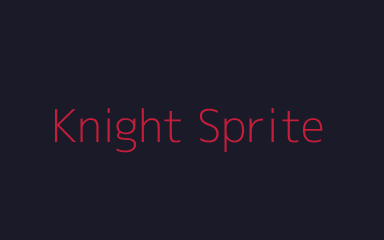
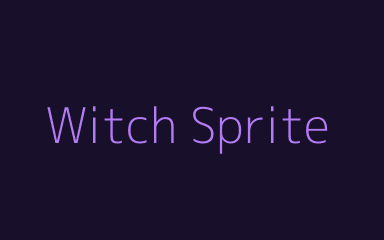

# PROMPTS FOR SOULS OF THE ABYSS - QUADCODE IDE VERSION

## WORKFLOW

**Agent assignments:**
1. **Cody/Jace** → game.js + index.html (code)
2. **Dali** → Sprite sheets (visuals)
3. **Sonic** → Animation JSON (motion specs)

Use these prompts in order. Each one produces files for the next step.

---

## PROMPT #1: GAME.JS (for Cody Developer)

**Action:** Copy below → Paste into Cody chat → Wait for response → Save as `game.js`

```
You are a JavaScript game developer building Dark Fantasy Survivors for Quadcode IDE.

## CRITICAL REQUIREMENTS

- NO TODOs, NO placeholders. COMPLETE code only.
- Reference: GAME-DESIGN.md (Parts 1-5)
- Sprites will be provided later by Dali; prepare Sprite class for image loading
- Animation specs will be JSON from Sonic; prepare animation state machine
- Canvas 1000x600, 60 FPS target
- No browser storage (localStorage banned)

## CORE CLASSES

**Vector2(x, y):**
- Methods: distance(other), angle(other), normalize(), add(v), subtract(v)

**Sprite(name, imageUrl, frameWidth, frameHeight, animationJson):**
- Properties: currentState, animationTime, frameIndex, image (preloaded)
- Methods: update(dt), getFrame() → {srcX, srcY}, draw(ctx, destX, destY, flipX)
- Fallback: If image fails to load, drawCircle(color) instead

**Weapon class with 9 weapons:**
- CursedBlade: 10 dmg, 1/sec, 100px cone 100°
- ShatterburstAxe: 15 dmg, 0.8/sec, AOE 50px explosion, knockback
- SoulreaverDagger: 5×3 hits, 2/sec, 20px range, 20% lifesteal
- EternalHalberd: 25 dmg, 0.5/sec, AOE 80px, knock+pull 200px
- ChaosOrb: 8×2-4 orbs, 1.2/sec, pierce, projectile
- ReapersScythe: 20 dmg, 0.8/sec, AOE 100px, pull 200px
- BloodmoonLance: 20 dmg, 1/sec, beam, 50% lifesteal (cap at maxHP)
- GodsayerSword: 100 dmg, E key, 1 Essence cost, 150px range, screen shake
- VoidSummoner: 3 tentacles × 5 dmg, spawn time 8 sec, 2 Essence cost

**Particle(x, y, vx, vy, lifetime, color, type):**
- Types: slash, explosion, spark, blood, glow
- Methods: update(dt), draw(ctx, time)
- Animations (from Sonic JSON): fade-out, trajectory, gravity

**Player(x, y, character):**
- Characters: knight (100 HP, 12 dmg, 110 range, 5 armor, +1/level), witch (70 HP, 8 dmg, 140 range), rogue (85 HP, 10 dmg, 90 range, 250 speed, 10% dodge, kill streak on 5 kills)
- Sprite: Load from sprites/knight.png, witch.png, rogue.png
- Animation states: idle, run, attack, hit, death (from animation JSON)
- Methods: update(dt, keys, enemies, canvas), takeDamage(dmg), gainExp(amt), attack(enemies), draw(ctx, time)

**Enemy(x, y, type, isElite):**
- Regular: zombie, spectre, cultist
- Elite: vampire, wraith, corrupted_knight, warden
- Boss: shadow_lord, void_rift, ancient_one
- Sprite: Load from sprites/[type].png
- Animation states: walk, attack, death
- Methods: update(dt, player, difficulty), takeDamage(dmg), draw(ctx, time)

**Soul(x, y, type):**
- Types: ethereal (+10 XP, white), essence (+1 charge, gold), corrupted (+20 XP, red), cursed (+50 XP, black)
- Methods: update(dt, player), draw(ctx, time)

**gameState object:**
- Properties: player, enemies[], souls[], particles[], gameTime, waveNumber, waveTimer, bossSpawnTimer, alive, keys, enemiesKilled, currentWeapon, weaponCharges, essenceCollected

## FUNCTIONS

**initGame(character):**
- Reset all state, create player at (500, 300), clear arrays, set alive = true

**spawnWave():**
- Every 30 seconds, spawn 5 + (waveNumber × 2) enemies
- Spawn in circle 100px around player
- 80% regular, 20% elite (probability-based)
- Apply difficulty multiplier = 1 + (gameTime / 4)

**spawnBoss():**
- Every 120 seconds, spawn next boss in rotation
- Spawn at random edge (off-screen initially)
- Shadow Lord → Void Rift → Ancient One (cycle)
- Screen shake effect

**gameLoop(dt):**
- gameTime += dt
- Update player, enemies, souls, particles
- Wave timer: spawn every 30s
- Boss timer: spawn every 120s
- Collision: enemies within 30px damage player
- Dead enemies: spawn souls (with probabilities), spawn particles, increment kills
- Dead particles: cleanup old ones (lifetime < 0)
- Check: player health ≤ 0 → alive = false

**drawGame(ctx, canvas):**
- Background: gradient purple → blue → black
- Map: mountains silhouettes, 8 pillars, center rune, walls, glow around player
- Entities: draw enemies, souls, particles, player (using Sprite.draw())
- HUD: time, level, HP bar, armor, wave number, enemy count, essence charges, boss timer

## ANIMATION STATE SYSTEM

Each entity has:
- currentState: 'idle' | 'run' | 'attack' | 'hit' | 'death'
- animationTime: seconds elapsed in current state
- frameIndex: current frame (0-N) based on animationTime

Animation JSON (from Sonic) provides:
```json
{
  "idle": {"frameCount": 8, "frameTime": 0.25, "loop": true},
  "run": {"frameCount": 4, "frameTime": 0.15, "loop": true},
  "attack": {"frameCount": 2, "frameTime": 0.2, "loop": false},
  "death": {"frameCount": 6, "frameTime": 0.15, "loop": false}
}
```

Use this to update frameIndex each frame:
```js
const animSpec = animationJson[currentState];
frameIndex = Math.floor(animationTime / animSpec.frameTime) % animSpec.frameCount;
```

## KEY MECHANICS

- Difficulty: multiplier = 1 + (gameTime / 4), applies to enemy stats
- Lifesteal: Dagger 20%, Lance 50%, cap at maxHealth
- Kill Streak (Rogue): 5 kills = +15% dmg (5 sec), resets on hit
- Essence economy: 5 collected = 1 charge
- Auto-attack: player attacks nearby enemies automatically
- Animation transitions: idle → run (when moving), run → idle (when stop), attack → idle (when anim ends)

## VALIDATION

// ✓ Player moves WASD, enemies spawn every 30s, bosses every 120s
// ✓ All 9 weapons work with correct mechanics and damage
// ✓ All 10 enemy types with stats match GAME-DESIGN
// ✓ Souls drop with correct probabilities
// ✓ Difficulty scales with time
// ✓ Animation states transition smoothly
// ✓ Sprite loading fallback to shapes if PNG missing
// ✓ HUD updates every frame
// ✓ 60 FPS performance
// ✓ NO console errors

## OUTPUT

Return ONLY game.js. NO markdown. NO explanations. Start with "class Vector2".
```

---

## PROMPT #2: INDEX.HTML (for Cody Developer)

**Action:** Copy below → Paste into Cody chat → Wait for response → Save as `index.html`

```
You are a web developer. Write index.html for Dark Fantasy Survivors game with sprite support.

## CONTEXT

You have game.js with all logic and animation system. This HTML integrates sprites from Dali.

## REQUIREMENTS

- Canvas 1000x600
- Character select buttons (Knight, Witch, Rogue) with onclick="selectChar()"
- HUD container with real-time updates (timer, level, HP, armor, wave, enemies, essence, boss timer)
- Death screen modal with stats
- WASD + E input handling
- Inline CSS only (dark theme, no external files)
- Inline JavaScript only
- <script src="game.js"></script> before </body>
- Image loading:
  - 
  - 
  - ... (one img tag per sprite)

## HTML STRUCTURE

- Proper HTML5 doctype, responsive meta tags
- Canvas with id="gameCanvas"
- Hidden img tags for sprite preloading
- HUD div with id="hud" (positioned absolutely, updates in real-time)
- Death screen div with id="deathScreen" (modal, centered)
- Character select buttons

## JAVASCRIPT FUNCTIONS NEEDED

- selectChar(char): Initialize game with character, start animation loop
- updateHUD(): Real-time updates from gameState
- showDeathScreen(): Display death stats
- loadSprites(): Preload all img tags into imageCache
- animate(): Main animation loop (requestAnimationFrame)

## INPUT HANDLING

- Document keydown/keyup for WASD and E key
- gameState.keys object: {w: false, a: false, s: false, d: false, e: false}
- E key: if gameState.player.weaponCharges > 0, decrement and trigger Godsayer

## IMAGE PATHS

Sprites folder structure (Dali will create):
- sprites/knight.png (character)
- sprites/witch.png
- sprites/rogue.png
- sprites/zombie.png, spectre.png, cultist.png (regular enemies)
- sprites/vampire.png, wraith.png, corrupted_knight.png, warden.png (elites)
- sprites/shadow_lord.png, void_rift.png, ancient_one.png (bosses)
- sprites/particles.png (all particle types)
- sprites/map.png (background)

## STYLING

- Dark theme: #0a0a0f background, #c41e3a accent
- HUD positioned top-left, death screen centered modal
- Character buttons with hover/active states
- Health bar with red fill
- Responsive layout

## OUTPUT

Return ONLY index.html. NO markdown. NO explanations. Start with "<!DOCTYPE html>".
```

---

## PROMPT #3: SPRITE SHEETS (for Dali Designer)

**Action:** Copy below → Paste into Dali chat → Wait for response → Organize sprites into folders

```
You are a digital artist. Create sprite sheets for Dark Fantasy Survivors game.

## REQUIREMENTS

All sprites:
- Format: PNG with transparency
- Color palette: Dark fantasy aesthetic
- Resolution: 48x48 pixels per frame (scale 2x in-game)
- Optimization: Indexed color, minimal file size
- Animation ready: Multiple frames horizontally, one row per animation state

## CHARACTER SPRITES (3 files)

**knight.png (5 animation rows, 8 frames each = 384x240)**
Row 1 (Idle): Standing with sword, armor glowing red, 8 frames breathing animation
Row 2 (Run): Legs moving forward, sword raised, cape flowing, 4 frames (loop)
Row 3 (Attack): Sword swing arc, 2 frames fast
Row 4 (Hit): Knocked back reaction, 2 frames
Row 5 (Death): Falls down and fades, 6 frames

**witch.png (5 animation rows, 8 frames each = 384x240)**
Row 1 (Idle): Standing with staff, robe flowing, aura glowing, 8 frames
Row 2 (Run): Levitating movement, robe trailing, 4 frames
Row 3 (Cast): Staff glow buildup, projectile appearing, 4 frames
Row 4 (Hit): Knockback with sparkles, 2 frames
Row 5 (Death): Dissipates into particles, 6 frames

**rogue.png (5 animation rows, 8 frames each = 384x240)**
Row 1 (Idle): Crouched dagger ready, shadows around, 8 frames subtle movement
Row 2 (Run): Dashing quick movement, blur trails, 3 frames (loop)
Row 3 (Attack): Dagger thrust, 2 frames
Row 4 (Dodge): Roll animation, invincibility effect, 4 frames
Row 5 (Death): Vanishes with shadow, 4 frames

## ENEMY SPRITES (10 files, same format)

**Regular Enemies:**
- zombie.png: Shambling walk (2 rows), attack (1 row), death (1 row)
- spectre.png: Floating ethereal (2 rows), attack (1 row), death (1 row)
- cultist.png: Walking robed (2 rows), casting (1 row), death (1 row)

**Elite Enemies:**
- vampire.png: Elegant walk (2 rows), attack (1 row), death (1 row)
- wraith.png: Spiral movement (2 rows), attack (1 row), death (1 row)
- corrupted_knight.png: Armored walk (2 rows), attack (1 row), death (1 row)
- warden.png: Patrol walk (2 rows), attack (1 row), death (1 row)

**Boss Enemies (3 files):**
- shadow_lord.png: Idle (2 rows pulsing), attack (1 row), phase change (1 row), death (1 row) - all large
- void_rift.png: Idle swirling (2 rows), attack (1 row), phase change (1 row), death (1 row)
- ancient_one.png: Idle cosmic (2 rows), attack (1 row), phase change (1 row), death (1 row)

Size: Bosses are 96x96 per frame (2x enemy size)

## EFFECT SPRITES

**particles.png (64x128 sheet):**
- Slash particles (4 frames small)
- Explosion circles (4 frames)
- Spark trails (3 frames)
- Blood drops (2 frames)
- Glow rings (4 frames)
- All small (16x16 to 32x32)

## MAP/UI

**map.png (1000x600 background):**
- Gradient background: purple top → blue middle → black bottom
- Fog effect: semi-transparent gray overlay
- Mountain silhouettes left/right edges
- 8 dark pillars placed around borders
- Center glowing ritual circle
- Semi-transparent walls to contain arena

**ui.png (optional, for HUD elements):**
- Health bar frame
- Essence soul icon
- Weapon icons (9 small icons)
- Borders and frames

## COLOR PALETTE (Dark Fantasy)

- Reds: Shadow Lord, Knight, Vampire (#c41e3a, #ff5459)
- Blues: Witch, Spectre, Warden (#3284c6, #32b8c6)
- Purples: Cultist, Rogue accent (#5f1e8f, #9e3fb0)
- Blacks: Wraith, Void Rift, background (#1f2121, #260828)
- Grays: Zombie, regular enemies (#434949, #6f7d7c)
- Golds: Soul pickups, essence (#f9d71c, #ffd700)
- Cyans: Warden, glow effects (#06b6d4)
- Reds/Oranges: Explosions, particles (#ff5459, #e68161)

## ANIMATION GUIDELINES

- Smooth transitions between frames
- No jarring jumps
- Loop animations should connect smoothly (first frame ≈ last frame)
- Attack animations can be punchy (abrupt end)
- Death animations: gradually fade or dissipate
- Boss animations: 1.5x slower than regular enemies (more menacing)
- Particle animations: fade out smoothly

## FILE NAMING

Save all in `sprites/` folder:
- sprites/knight.png
- sprites/witch.png
- sprites/rogue.png
- sprites/zombie.png
- ... (all 10 enemies)
- sprites/shadow_lord.png
- sprites/void_rift.png
- sprites/ancient_one.png
- sprites/particles.png
- sprites/map.png

Total: 15 PNG files

## QUALITY CHECKLIST

✓ All sprites have consistent art style
✓ Animation frames are aligned properly (no off-center)
✓ Transparency works (PNG alpha channel)
✓ File sizes optimized (indexed color, no unnecessary data)
✓ All animation states present (idle, run, attack, death minimum)
✓ Character sprites easily distinguishable
✓ Enemy sprites fit dark fantasy theme
✓ Boss sprites clearly larger/more menacing
✓ Particle sprites small and clean
✓ Background map professional looking

## OUTPUT

Generate all 15 PNG files in sprites/ folder. No other formats. Optimize for web.
```

---

## PROMPT #4: ANIMATION SPECS (for Sonic Motion Designer)

**Action:** Copy below → Paste into Sonic chat → Wait for response → Save JSON files

```
You are a motion designer. Create animation specifications for Dark Fantasy Survivors.

## OUTPUT FORMAT

Create JSON files in `animations/` folder with frame timing and state transitions.

## TEMPLATE (for each entity type)

```json
{
  "entityType": "knight",
  "spriteSize": 48,
  "animations": {
    "idle": {
      "frameCount": 8,
      "frameTime": 0.25,
      "loop": true,
      "nextState": "idle"
    },
    "run": {
      "frameCount": 4,
      "frameTime": 0.15,
      "loop": true,
      "nextState": "run"
    },
    "attack": {
      "frameCount": 2,
      "frameTime": 0.2,
      "loop": false,
      "nextState": "idle",
      "damageFrame": 1
    },
    "hit": {
      "frameCount": 2,
      "frameTime": 0.15,
      "loop": false,
      "nextState": "idle"
    },
    "death": {
      "frameCount": 6,
      "frameTime": 0.15,
      "loop": false,
      "nextState": "death"
    }
  },
  "transitions": {
    "idle": ["run", "attack", "hit", "death"],
    "run": ["idle", "attack", "hit", "death"],
    "attack": ["idle"],
    "hit": ["idle"],
    "death": []
  },
  "physics": {
    "gravity": 0,
    "friction": 0
  }
}
```

## FILES TO CREATE

**Character animations (3 files):**
- animations/knight.json
- animations/witch.json
- animations/rogue.json

**Enemy animations (7 files):**
- animations/zombie.json
- animations/spectre.json
- animations/cultist.json
- animations/vampire.json
- animations/wraith.json
- animations/corrupted_knight.json
- animations/warden.json

**Boss animations (3 files):**
- animations/shadow_lord.json (size: 96)
- animations/void_rift.json (size: 96)
- animations/ancient_one.json (size: 96)

**Effects (1 file):**
- animations/particles.json

Total: 14 JSON files

## SPECIFIC TIMING

### Character Animations

**Knight (heavy, slow):**
- Idle: 8 frames, 0.25s each = 2s loop
- Run: 4 frames, 0.15s each = 0.6s loop
- Attack: 2 frames, 0.2s each = 0.4s
- Hit: 2 frames, 0.15s = 0.3s
- Death: 6 frames, 0.15s = 0.9s

**Witch (smooth, magical):**
- Idle: 8 frames, 0.25s = 2s (breathing + aura)
- Run: 4 frames, 0.15s = 0.6s
- Cast: 4 frames, 0.15s = 0.6s (glowing buildup)
- Hit: 2 frames, 0.15s = 0.3s
- Death: 6 frames, 0.2s = 1.2s (dissipate slow)

**Rogue (fast, snappy):**
- Idle: 8 frames, 0.15s = 1.2s (subtle movement)
- Run: 3 frames, 0.1s = 0.3s (fast dashing)
- Attack: 2 frames, 0.1s = 0.2s (instant stab)
- Dodge: 4 frames, 0.12s = 0.48s (quick roll)
- Death: 4 frames, 0.1s = 0.4s (quick vanish)

### Enemy Animations

**Regular (Zombie, Spectre, Cultist):**
- Walk: 2 frames, 0.5s = 1s loop (slow shamble)
- Attack: 1 frame, 0.4s (1 frame attack, no animation)
- Death: 4 frames, 0.15s = 0.6s

**Elite (Vampire, Wraith, Corrupted Knight, Warden):**
- Walk: 2 frames, 0.4s = 0.8s loop
- Attack: 1 frame, 0.4s
- Death: 4 frames, 0.15s = 0.6s

### Boss Animations

**Shadow Lord, Void Rift, Ancient One:**
- Idle: 2 frames, 0.5s = 1s loop (pulsing/breathing)
- Attack: 1 frame, 0.8s (long attack wind-up)
- Phase change: 1 frame, 1s (intensity shift at 50% HP)
- Death: 1 frame, 2s (slow explosion/disappear)

### Particle Animations

```json
{
  "entityType": "particles",
  "animations": {
    "slash": {"frameCount": 4, "frameTime": 0.08, "loop": false},
    "explosion": {"frameCount": 4, "frameTime": 0.1, "loop": false},
    "spark": {"frameCount": 3, "frameTime": 0.1, "loop": false},
    "blood": {"frameCount": 2, "frameTime": 0.12, "loop": false},
    "glow": {"frameCount": 4, "frameTime": 0.1, "loop": false}
  }
}
```

## EASING & PHYSICS (Optional, for advanced animation)

If supporting easing curves:
```json
"attack": {
  "easing": "ease-in-out",
  "duration": 0.4,
  "dampening": 0.8
}
```

This allows smooth acceleration/deceleration on attacks.

## VALIDATION

✓ All animation states present for each entity
✓ Frame counts match sprite sheets
✓ Timing creates smooth loops (connection between frames)
✓ Transitions make sense (attack → idle, not attack → run)
✓ Boss animations slower/longer than regular enemies
✓ No animation state lasts less than 0.1s or more than 3s
✓ All JSON valid syntax

## OUTPUT

Create 14 JSON files in animations/ folder. Provide complete, valid JSON. NO markdown.
```

---

## FINAL CHECKLIST

1. **Cody** generates `game.js` ✓
2. **Cody** generates `index.html` ✓
3. **Dali** generates 15 PNG sprites in `sprites/` ✓
4. **Sonic** generates 14 JSON animations in `animations/` ✓
5. Test in browser: Load sprites → Animate → Play game ✓

All files work together seamlessly.
